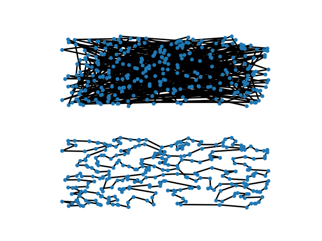

# TSP - решение задачи коммивояжера

Решение задачи коммивояжера в случае действительных чисел (ориентированный граф с весами)

## Запуск

0. Установить Python3, git и выполнить команды `git clone https://github.com/Tixonmavrin/tsp` and `cd tsp`

1. Установить зависимости:
`pip3 install -r requirements.txt`

3. Запустить пример:
`python3 example.py`

## Алгоритм работы

### 1. Поиск приближения

- Ищутся кратчайщие расстояния между всеми вершинами (условно, из пункта А в пункт Б можно попасть извилистой дорогой, а можно напрямую, но через другой город). Используется `shortest_path` из `scipy.sparse.csgraph`, который под собой может использовать различные алгоритмы в зависимости от входа;
- Выбирается жадно первое приближение решения. Для этого сначала выбирается ребро с наименьшим весом, затем из допустимых снова выбирается самое короткое ребро и так далее;
- На выходе получим цикл из вершин.

Также поддерживается оптимизация, которая начинается со случайного решения.

### 2. Улучшение решения
Совершается `n` итераций. На каждой итерации происходит следующее:
1. Выбирается число базовых операций `m` (к примеру, смена местами двух вершин в цикле или разворот подотрезка);
2. `m` раз совершаем базовые операции. Они могут быть как совсем случайными (берем рандомно 2 индекса), так и не совсем. Сейчас есть поддержка выбора вершин на основе их удаленности от соседей с элементом случайности (используется `softmax` расстояний до соседних вершин в цикле для присвоения вероятности выпадания каждой вершины). В будущем можно будет добавить перебор всех или некоторых пар вершин с совершением операции для них, и выбор уже будет осуществляться со знанием, насколько удалось уменьшить расстояние. Это можно развить дальше и перебирать 2, 3 и более последовательных операций. Тогда появится задача поиска оптимального их количества;
3. Если расстояние уменьшилось, с каким-то условием можем перейти в новое состояние (принять новый цикл);
4. Аналогично поступаем, если расстояние увеличилось.

### 3. Конкретные реализации

Библиотека гибкая и поддерживает множество параметров и условий. Сейчас разберем конкретную реализацию, использующую метод отжига. 

Проверять эффективность будем на планарных графах. 

1. Из операций оставим смену вершин местами и разворот на подотрезке. Разворот более приоритетный (смена случайных вершин местами реже приносит уменьшение расстояния), так что вероятность совершения разворота больше;
2. Разворот на подотрезке делается с учетом расстояний между вершин (`softmax`);
3. Смена двух вершин тоже учитывает расстояния. А именно для выбора первой вершинки используется `softmax`, а расстояние до второй выбирается из геометрического распределения (случайно меняем знак). 
4. Число операций из геометрического распределения;
5. Если расстояние уменьшилось - принимаем всегда;
6. Если расстояние не уменьшилось - принимаем с какой-то вероятностью. Сейчас используется такая функций вероятности, которая зависит от начального расстояния, нового и номера шага:

```python
def p(self, distance, new_distance, step, losses):
    tempr = min(0.01, 1. * pow(step + 1.0, -0.5))
    return np.random.binomial(n=1, p=np.exp((distance - new_distance) / tempr))
```

### 4. О методе отжига

### 5. Результаты

Для подсчета результатов взяли случайный граф из двумерного равномерного распределения. Число вершин равно `300`.
Число итераций алгоритма возьмем равным `100 000`, вероятность разворота на отрезке равной `0.9`. Число операций распределено геометрически с параметром `0.95`

#### 1. Начиная со случайного графа

- Случайный и оптимизированный циклы:
<p align="center"></p>

- Изменение ошибки во время обучения:
<p align="center"></p>

Кратчайшее расстояние из первого приближения: `160.52742003355974`

Итоговое кратчайшее расстояние: `14.439222823666938`

Время выполнения на MacBook Pro 2019 (processor 2.4 GHz Quad-Core Intel Core i5): `71.18223404884338` секунд


#### 2. Начиная с жадного алгоритма

- Жадный и оптимизированный циклы:
<p align="center"></p>

- Изменение ошибки во время обучения:
<p align="center"></p>

Кратчайшее расстояние из первого приближения: `16.88694564793836`

Итоговое кратчайшее расстояние: `14.021738553498817`

Время выполнения на MacBook Pro 2019 (processor 2.4 GHz Quad-Core Intel Core i5): `79.3436107635498` секунд