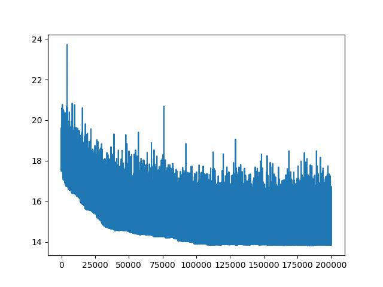

# TSP - решение задачи коммивояжера

Решение задачи коммивояжера в случае действительных чисел (ориентированный граф с весами)

## Запуск

0. Установить Python3, git и выполнить команды `git clone https://github.com/Tixonmavrin/tsp` and `cd tsp`

1. Установить зависимости:
`pip3 install -r requirements.txt`

3. Запустить пример:
`python3 example.py`

## Алгоритм работы

### 1. Поиск приближения

- Ищутся кратчайщие расстояния между всеми вершинами (условно, из пункта А в пункт Б можно попасть извилистой дорогой, а можно напрямую, но через другой город). Используется `shortest_path` из `scipy.sparse.csgraph`, который под собой может использовать различные алгоритмы в зависимости от входа;
- Выбирается жадно первое приближение решения. Для этого сначала выбирается ребро с наименьшим весом, затем из допустимых снова выбирается самое короткое ребро и так далее;
- На выходе получим цикл из вершин.

Также поддерживается оптимизация, которая начинается со случайного решения.

### 2. Улучшение решения
Совершается `n` итераций. На каждой итерации происходит следующее:
1. Выбирается число базовых операций `m` (к примеру, смена местами двух вершин в цикле или разворот подотрезка);
2. `m` раз совершаем базовые операции. Они могут быть как совсем случайными (берем рандомно 2 индекса), так и не совсем. Сейчас есть поддержка выбора вершин на основе их удаленности от соседей с элементом случайности (используется `softmax` расстояний до соседних вершин в цикле для присвоения вероятности выпадания каждой вершины). В будущем можно будет добавить перебор всех или некоторых пар вершин с совершением операции для них, и выбор уже будет осуществляться со знанием, насколько удалось уменьшить расстояние. Это можно развить дальше и перебирать 2, 3 и более последовательных операций. Тогда появится задача поиска оптимального их количества. Но это косвенным образом относится к методу имитации отжига;
3. Если расстояние уменьшилось, с каким-то условием можем перейти в новое состояние (принять новый цикл). Стандартно - с вероятностью 1;
4. Аналогично поступаем, если расстояние увеличилось (то есть все равно с какой-то небольшой вероятностью сможем принять новый цикл).

### 3. Пример использования

Разберем конкретную реализацию, использующую метод отжига. Проверять эффективность будем на планарных графах (подсчет метрик и визуализация).

1. Из операций оставим смену вершин местами и разворот на подотрезке. Разворот более приоритетный (смена случайных вершин местами реже приносит уменьшение расстояния), так что вероятность совершения разворота больше;
2. Разворот на подотрезке делается с учетом расстояний между вершинами (`softmax`). То есть если вершина сильно удалена от соседних, вероятность ее выбора больше;
3. Смена двух вершин тоже учитывает расстояния. А именно для выбора первой вершинки используется `softmax`, а расстояние до второй выбирается из геометрического распределения (у полученного значения случайно меняем знак). 
4. Число операций (смен вершин и разворотов подотрезков) выбирается из геометрического распределения;
5. Если расстояние в цикле уменьшилось - принимаем цикл всегда;
6. Если расстояние не уменьшилось - принимаем с какой-то вероятностью. Здесь используем метод отжига, параметр которого меняется во времени;

Важно, что берем простой алгоритм изменения температуры. Он показан для примера, поэтому стоит смело пробовать другие значения. 

### 4. О методе отжига

Понятно, что текущий алгоритм представляет из себя применение метода отжига для задачи коммивояжера с некоторыми оптимизациями. 

Материалы про метод отжига:
1. https://arxiv.org/pdf/2009.06188.pdf

### 5. Результаты

#### Оптимизация случайного цикла:

Кратчайшее расстояние из первого приближения: 164.03007640235094
Итоговое кратчайшее расстояние: 13.552073068180226
Время работы на MacBook Pro 2019 (processor 2.4 GHz Quad-Core Intel Core i5): 161.54869985580444

- Случайный и оптимизированный циклы:

- Изменение ошибки во время обучения:

#### Оптимизация жадного решения:

Кратчайшее расстояние из первого приближения: 17.496419571917126
Итоговое кратчайшее расстояние: 13.826430878421696
Время работы на MacBook Pro 2019 (processor 2.4 GHz Quad-Core Intel Core i5): 157.51052904129028

- Жадный и оптимизированный циклы:

- Изменение ошибки во время обучения:

Видно, что алгоритм находит достаточно хорошее решение, но не позволяет еще сильнее приблизиться к оптимальному решению, потому что для этого бы пришлось сильно перестраивать структуру графа, что алгоритм сделает с почти нулевой вероятностью. 

### 6. Что дальше?

Для улучшения работы алгоритма можно:
1. Подобрать другие гиперпараметры;
2. Подобрать зависимости параметров от графа (числа его вершин);
3. Использовать другой алгоритм выбора температуры (адаптивный);
4. Использовать другие распределения;
5. Использовать другие операции над циклом;
6. Взять более продвинутый жадный алгоритм;
7. Использовать техники из deep learning;
8. Использовать RL и другие техники для оптимизации (гипер)параметров во время обучения (на разных стадиях будут лучше подходить различные операции над циклом, различное цисло операций).